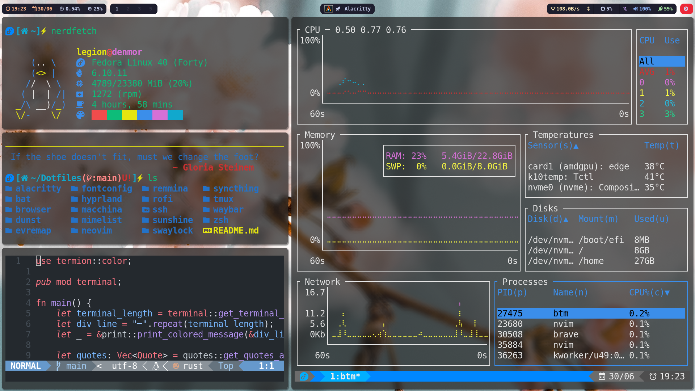

# 🔧 MyDotfiles
Welcome to the foundation stone of HappyLand! This repository contains my personal configuration files for various applications and environments, designed to enhance my productivity, streamline my workflow and keep me happy with my HappyLand.



## 📖 Table of Contents

- [✨ Features](#features)
- [🚀 Installation](#installation)
- [🛠️ Usage](#usage)
- [🗑️ Uninstall](#uninstall)
- [🐛 Bugs or Requests](#bugs-or-requests)
- [🤝 Contributing](#contributing)
- [📄 License](#license)
- [🙏 Acknowledgments](#acknowledgments)

## ✨ Features

## 🚀 Installation
> You will need `git` and GNU `stow`

- Clone this repo into your `$HOME/dotfiles` directory or `~/dotfiles`
```bash
git clone https://github.com/jollySleeper/dotfiles.git ~/dotfiles && cd ~/dotfiles
```

## 🛠️ Usage

To sync configurations, use `stow`, which is a symlink manager that allows you to manage your dotfiles easily. It creates symbolic links from the specified configuration directories in your `dotfiles` repository to the appropriate locations in your home directory. This way, you can keep your configurations organized and easily switch between different setups.

### Single Config
```bash
stow zsh # Just the zsh config
```

### Multiple Configs
```bash
stow alacritty bat neovim # Alacritty, Bat & Neovim Config
```

### Everything
```bash
stow */ # Everything (the '/' ignores the files(Ex: README))
```

## 🗑️ Uninstall

If you decide to uninstall, we're sorry to hear that the settings didn't meet your expectations. We appreciate your feedback. 
To uninstall configurations of an app, run `rm ~/.config/<app_name>` from the terminal, replacing `<app_name>` with the actual name of the application you want to uninstall. After that, you can delete the `dotfiles` folder using the command `rm -r ~/dotfiles`.

## 🐛 Bugs or Requests

If you encounter any problem(s) feel free to open an [issue](https://github.com/jollySleeper/Dotfiles/issues/new).
If you feel the project is missing a feature, please raise an [issue](https://github.com/jollySleeper/Dotfiles/issues/new) with `FeatureRequest` as heading.

## 🤝 Contributing

Contributions are welcome! Please follow these steps:

1. Fork the repository.
2. Create a new branch (`git checkout -b feature/YourFeature`).
3. Make your changes and commit them (`git commit -m 'Add some feature'`).
4. Push to the branch (`git push origin feature/YourFeature`).
5. Open a pull request.

## 📄 License

This project is licensed under the MIT License - see the [LICENSE](https://github.com/jollySleeper/Dotfiles/blob/main/LICENSE) file for details.

## 🙏 Acknowledgments

- Managing dotfiles with Stow by chris@machine -> [Video](https://www.youtube.com/watch?v=90xMTKml9O0): A tutorial on how to effectively manage your dotfiles using GNU Stow.
- My New Desktop by Chris Titus Tech -> [Video](https://www.youtube.com/watch?v=wNL6eIoksd8), [Github](https://github.com/ChrisTitusTech/hyprland-titus): A guide to setting up Hyprland desktop environment with various tools and configurations.
- Neovim RC From Scratch by ThePrimeagen -> [Video](https://www.youtube.com/watch?v=w7i4amO_zaE), [Github](https://github.com/ThePrimeagen/init.lua): A comprehensive walkthrough on setting up Neovim from the ground up.
- Effective Neovim by TJ DeVries -> [Video](https://www.youtube.com/watch?v=stqUbv-5u2s), [Github](https://github.com/nvim-lua/kickstart.nvim): A resource for optimizing your Neovim setup with useful plugins and configurations.
- Thanks to the sources mentioned above and many other sources for helping me in achieving the HappyLand setup.
